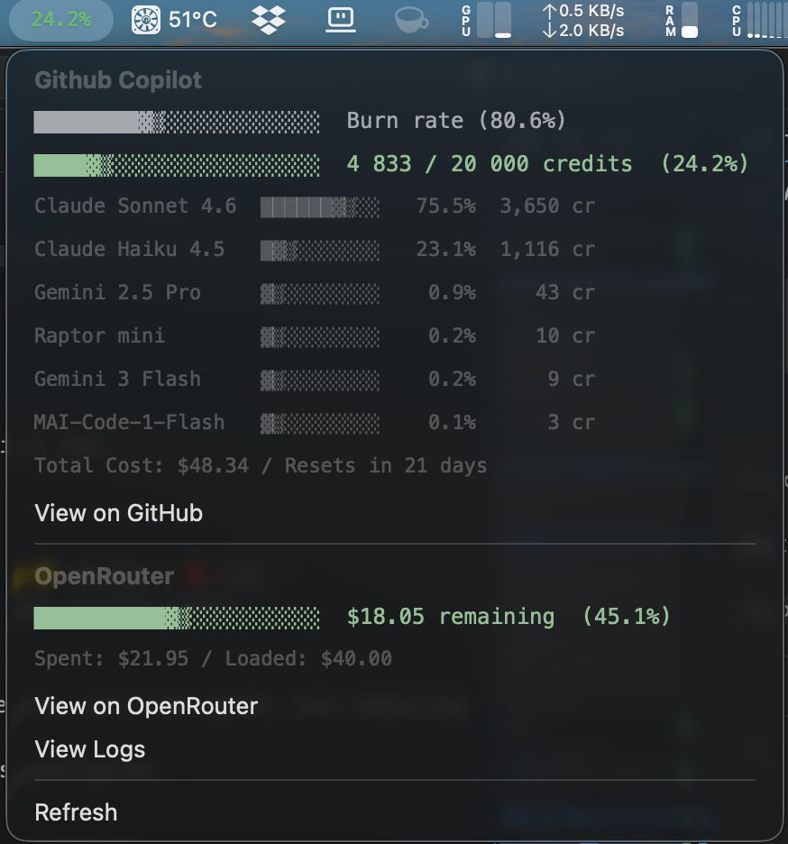

# GitHub Copilot AI Credits Usage Widget for macOS

> 🍴 **Fork** of [GitHub Copilot usage tracking widget](https://github.com/bristena-op/copilot-usage-tracker) — modified to track **AI Credits** instead of Premium Requests, with per-model breakdown and Python implementation.
> - **Original:** https://github.com/bristena-op/copilot-usage-tracker
> - **Maintained by:** [@pae46](https://github.com/pae46)

A SwiftBar/xbar menu bar widget that shows your GitHub Copilot AI Credits usage with a detailed breakdown by model.

## Features

**What's different in this fork:**
- Tracks **AI Credits** (instead of Premium Requests)
- **Per-model breakdown**: Claude Sonnet, Claude Haiku, Gemini, etc.
- **Python** implementation (no external dependencies)
- **Total cost** displayed in USD
- Supports configurable plan limits (Pro, Pro+, Max)
- Shows usage percentage in menu bar (color-coded: 🟢 green → 🟡 yellow → 🔴 red)
- **Burn-rate** indicator compared with expected usage pace for the current month
- Progress bar with credits used/total
- Days until monthly reset
- **OpenRouter integration** (optional): Track loaded credits, all-time spend, and remaining balance
  - OpenRouter section appears only when a management key is configured
  - View links to OpenRouter activity and logs

## Screenshots


## Requirements

- macOS
- [SwiftBar](https://github.com/swiftbar/SwiftBar) or [xbar](https://xbarapp.com/)
- Python 3.12+ recommended
- GitHub Personal Access Token with billing permissions

## Installation

### 1. Install SwiftBar

```bash
brew install swiftbar
```

### 2. Create a GitHub Personal Access Token

1. Go to [GitHub Token Settings](https://github.com/settings/tokens?type=beta)
2. Click **Generate new token** (Fine-grained)
3. Give it a name like "Copilot Usage Widget"
4. Under **Account permissions**, enable **Plan** → **Read-only**
5. Generate and copy the token

### 3. Configure with .env file

1. Clone this repo or download `copilot-spending.py`
2. Copy and configure `.env`:
   ```bash
   cp .env.example .env
   ```
3. Edit `.env` and add your GitHub values:
   ```env
   GITHUB_TOKEN=github_pat_YOUR_TOKEN_HERE
   GITHUB_USERNAME=your_github_username
   PLAN_LIMIT=1500
   ORANGE_THRESHOLD=1.0
   RED_THRESHOLD=1.2
   ```
   - `GITHUB_TOKEN`: Your Personal Access Token from step 2
   - `GITHUB_USERNAME`: Your GitHub username
   - `PLAN_LIMIT`: Your monthly AI Credits limit. Examples: Pro `1500`, Pro+ `7000`, Max `20000`
   - `ORANGE_THRESHOLD`: Burn-rate warning threshold. `1.0` means at expected pace
   - `RED_THRESHOLD`: Burn-rate critical threshold. `1.2` means 20% ahead of expected pace

4. **(Optional) Configure OpenRouter:**
   ```env
   OPENROUTER_MANAGEMENT_KEY=sk_your_openrouter_management_key
   ```
   - Get a **Management API key** from [OpenRouter settings](https://openrouter.ai/settings/keys)
   - Use the management key name in `.env` (`OPENROUTER_MANAGEMENT_KEY`)

**Note:** `.env` is never committed to git (see `.gitignore`). Safe for local use only!

### 4. Install to SwiftBar

```bash
# Make executable
chmod +x copilot-spending.py

# Copy to SwiftBar plugins folder
cp copilot-spending.py "$HOME/Library/Application Support/SwiftBar/Plugins/"
```

Or create a symlink (recommended for development):
```bash
ln -s "$(pwd)/copilot-spending.py" "$HOME/Library/Application Support/SwiftBar/Plugins/"
```

### 5. Refresh SwiftBar

Click the SwiftBar icon → Refresh All

## Refresh Interval

The refresh interval is controlled by the `swiftbar.schedule` header in the script (default: every 2 minutes).
To change, edit the header at the top of `copilot-spending.py`:
```python
# <swiftbar.schedule>*/2 * * * *</swiftbar.schedule>
```
(Cron format: `minute hour day month weekday`)

## API Endpoints Used

### GitHub Copilot
- `GET /users/{username}/settings/billing/ai_credit/usage` — AI Credits usage per model
- Per-month breakdown with costs in USD

### OpenRouter (Optional)
- `GET /api/v1/credits` — Current loaded credits, all-time usage, and remaining balance

## Troubleshooting

**Plugin not appearing**
- Check SwiftBar is running
- Verify file is in `~/Library/Application Support/SwiftBar/Plugins/`
- Test manually: `python3 copilot-spending.py`

**Showing "Error"**
- Verify `GITHUB_TOKEN` is correct and has "Plan" permission
- Check `GITHUB_USERNAME` matches your GitHub account
- Ensure token hasn't expired

**Wrong usage numbers**
- Verify you're on the correct plan (Pro vs Pro+)
- Check `PLAN_LIMIT` matches your subscription
- Token needs "Plan" read permission in Account settings
- **Note:** if you change plans during the month (for example, from Pro to Pro+), AI Credits values may be inaccurate because the limit and billing may be calculated according to the plan active during each period.

## Development

Test locally:
```bash
python3 copilot-spending.py
```

SwiftBar format reference:
- Menu bar title (first line): `25.4% | color=#3fb950`
- Dropdown separator: `---`
- Standard output format for menu items

## License

MIT

---

**Contributing**: Feel free to fork, modify, and adapt for your needs!
